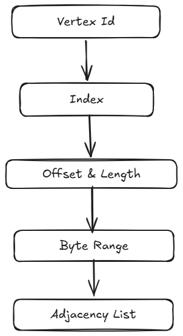

# BARE

**Binary Adjacency Range Encoding**

**BARE** is a binary file format for storing **Graph Adjacency Lists** (GALs) as **Directly Addressable Byte Ranges** (DABRs, pronounced *Dabbers*).

It is based on **BAR (Binary Adjacency Range)**, a storage model built around a simple idea:

> A vertex's adjacency list should be locatable as a contiguous byte range.



**BAR - Binary Adjacency Range** is the underlying storage model.

For each vertex BAR represents its adjacency list as a byte range:

```text
vertex -> (offset, length)
```

This separates the logical graph from its physical representation and makes operations such as **locating a vertex**, **reading its neighbors**, **skipping unrelated vertices**, and **performing random-access reads** possible **without scanning the entire graph**.

BAR is the **model**.

**BARE - Binary Adjacency Range Encoding** is a file format designed to persist the BAR model.

The initial format is intentionally simple:

```text
┌─────────────────────┐
│ File Header         │
├─────────────────────┤
│ Vertex Index        │
├─────────────────────┤
│ Adjacency Data      │
├─────────────────────┤
│ Footer / Metadata   │
└─────────────────────┘
```

The format will evolve through several stages, beginning with basic binary encoding and progressively introducing indexing, compression, partitioning, and distributed access.

## Research Questions

The project investigates whether a storage format designed specifically around adjacency-list access can provide useful properties for graph workloads.

The main questions are:

1. How should adjacency lists be laid out on disk?
2. How can vertex IDs be mapped efficiently to byte ranges?
3. What indexing strategy provides efficient random access?
4. How can adjacency data be compressed without making access expensive?
5. How does partitioning affect locality and access performance?
6. How does the format compare with general-purpose columnar storage for graph workloads?

## Roadmap

- Phase 1: Raw binary format  
- Phase 2: Schema and typed values
- Phase 3: Offset / length addressing
- Phase 4: Adjacency-list storage
- Phase 5: On-disk random access
- Phase 6: Vertex indexing
- Phase 7: Partitioned files
- Phase 8: Distributed graph access
- Phase 9: Spark DataSource
- Phase 10: Benchmark and evaluation

## Paper

BARE is being developed alongside a research paper investigating the **Binary Adjacency Range** storage model and its implementation as a persistent file format.

The paper will focus on:

* Storage layout
* Indexing
* Locality
* Compression
* Random access
* Partitioning
* Scalability
* Empirical evaluation

The implementation serves as the experimental basis for the paper.

## Status

**Research / Experimental**

The format is not yet stable and the specification may change as the research progresses.

## License

[BSD-3-CLause](LICENSE)
